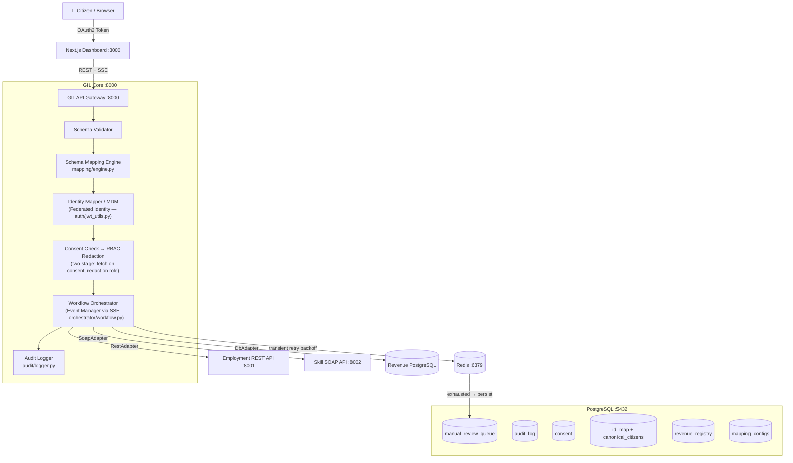

# SIH26129 — Government Interoperability Framework (GIL)

**GenZCoders** | Govt. of Maharashtra, Dept. of Skills, Employment, Entrepreneurship & Innovation

> Brownfield middleware that unifies siloed departmental systems without replacing them —
> providing schema mapping, federated identity, consent management, RBAC, workflow orchestration,
> immutable audit logging, and resilient failure handling.

---

## Architecture



### Queue Design (Two-Tier)
- **Redis** — transient, holds in-flight retry jobs with exponential backoff; cleared on success or exhaustion
- **PostgreSQL `manual_review_queue`** — permanent, written only when `retry_count >= max_attempts`; source of truth for dashboard

### RBAC Two-Stage Model
1. **Consent** → determines whether `adapter.fetch()` is called at all
2. **RBAC** → applied post-aggregation; redacts fields the requesting role cannot see

---

## Repository Structure

```
sih-gil/
├── docker-compose.yml             # 6 services
├── .env.example                   # all secrets via env vars
├── README.md
├── infra/
│   ├── postgres/init.sql          # DDL + seed data (pgcrypto, all tables)
│   └── redis/redis.conf
├── gil-core/                      # GIL middleware (FastAPI :8000)
│   ├── auth/                      # JWT + OAuth2 simulation
│   ├── adapters/                  # RestAdapter, SoapAdapter, DbAdapter
│   ├── mapping/configs/           # employment.yaml, skill.yaml, revenue.yaml
│   ├── identity/mdm.py            # Cross-system ID federation
│   ├── consent/manager.py         # Consent check + grant/revoke
│   ├── rbac/                      # policy.json + enforcer.py
│   ├── orchestrator/              # workflow.py (SSE) + retry.py
│   ├── audit/logger.py            # Immutable append-only
│   ├── monitoring/metrics.py      # Prometheus metrics
│   ├── gateway/router.py          # All API routes
│   └── tests/                     # unit/ + integration/
├── mock-employment-system/        # REST API :8001
├── mock-skill-system/             # SOAP/XML API :8002
├── mock-revenue-system/           # DB direct (seed.sql only)
└── frontend/                      # Next.js dashboard :3000
```

---

## Quick Start

### Prerequisites
- Docker + Docker Compose v2
- (Optional) Node.js 20 for local frontend dev

### 1. Clone & configure

```bash
git clone <repo-url> sih-gil
cd sih-gil
cp .env.example .env
# Edit .env and set strong secrets for JWT_SECRET and SERVICE_JWT_SECRET
```

### 2. Start all services

```bash
docker-compose up --build -d
# Wait ~30s for healthchecks to pass
docker-compose ps
```

### 3. Verify health

```bash
curl http://localhost:8000/health
curl http://localhost:8001/health
curl http://localhost:8002/health
```

### 4. Open the dashboard

```
http://localhost:3000
```

---

## Demo Walkthrough (cURL)

### Step 1 — Get a citizen token

```bash
TOKEN=$(curl -s -X POST http://localhost:8000/auth/token \
  -H "Content-Type: application/json" \
  -d '{"username":"MAHA-2024-001","password":"demo","role":"GILService"}' \
  | python3 -c "import sys,json; print(json.load(sys.stdin)['access_token'])")
echo "Token: ${TOKEN:0:40}..."
```

### Step 2 — Submit consolidated request (3 systems)

```bash
RESP=$(curl -s -X POST http://localhost:8000/api/v1/requests \
  -H "Authorization: Bearer $TOKEN" \
  -H "Content-Type: application/json" \
  -d '{
    "citizen_id": "MAHA-2024-001",
    "data_categories": ["employment","skills","revenue"],
    "purpose": "scheme_eligibility_check",
    "requested_by": "SkillDeptOfficer"
  }')
echo "$RESP"
REQUEST_ID=$(echo $RESP | python3 -c "import sys,json; print(json.load(sys.stdin)['request_id'])")
echo "Request ID: $REQUEST_ID"
```

**Identity reconciliation happening internally:**
- `MAHA-2024-001` → `EMP-7789` (Employment) / `SK-2031` (Skill) / `LP-3301` (Revenue)

### Step 3 — Watch real-time SSE status stream

```bash
curl -N -H "Authorization: Bearer $TOKEN" \
  "http://localhost:8000/api/v1/requests/$REQUEST_ID/stream"
```

### Step 4 — Poll final status + consolidated result

```bash
curl -s -H "Authorization: Bearer $TOKEN" \
  "http://localhost:8000/api/v1/requests/$REQUEST_ID/status" | python3 -m json.tool
```

**Expected RBAC redactions for SkillDeptOfficer:**
- `monthly_income → <redacted>`
- `land_parcel_id → <redacted>`
- `tax_status → <redacted>`
- `outstanding_amount → <redacted>`

### Step 5 — Simulate failure → retry → manual review

```bash
# Enable failure mode on Employment system
curl -s -X POST http://localhost:8001/admin/toggle-failure
# OR via GIL gateway:
curl -s -X POST -H "Authorization: Bearer $TOKEN" \
  http://localhost:8000/api/v1/admin/toggle-failure/employment

# Submit new request (will retry 3× with backoff → manual_review)
curl -s -X POST http://localhost:8000/api/v1/requests \
  -H "Authorization: Bearer $TOKEN" \
  -H "Content-Type: application/json" \
  -d '{"citizen_id":"MAHA-2024-001","data_categories":["employment"],"purpose":"failure_demo","requested_by":"GILService"}'

# Wait ~14s for retries to exhaust, then:
curl -s -H "Authorization: Bearer $TOKEN" \
  http://localhost:8000/api/v1/manual-review | python3 -m json.tool

# Restore normal operation
curl -s -X POST http://localhost:8001/admin/toggle-failure
```

### Step 6 — View audit log

```bash
curl -s -H "Authorization: Bearer $TOKEN" \
  "http://localhost:8000/api/v1/audit/$REQUEST_ID" | python3 -m json.tool
```

### Step 7 — Resolve manual review item

```bash
REVIEW_ID=$(curl -s -H "Authorization: Bearer $TOKEN" \
  http://localhost:8000/api/v1/manual-review \
  | python3 -c "import sys,json; items=json.load(sys.stdin)['items']; print(items[0]['id'] if items else '')")

curl -s -X POST -H "Authorization: Bearer $TOKEN" \
  -H "Content-Type: application/json" \
  -d '{"resolved_by":"officer-001","notes":"manually verified during demo"}' \
  "http://localhost:8000/api/v1/manual-review/$REVIEW_ID/resolve"
```

### Step 8 — Test consent denial

```bash
# Revoke consent for Rahul Deshmukh
curl -s -X POST -H "Authorization: Bearer $TOKEN" \
  -H "Content-Type: application/json" \
  -d '{"citizen_id":"MAHA-2024-002","data_categories":[],"revoke":true,"granted_by":"demo"}' \
  http://localhost:8000/api/v1/consent

# Attempt to fetch data (will fail at consent-check stage)
curl -s -X POST -H "Authorization: Bearer $TOKEN" \
  -H "Content-Type: application/json" \
  -d '{"citizen_id":"MAHA-2024-002","data_categories":["employment"],"purpose":"test","requested_by":"GILService"}' \
  http://localhost:8000/api/v1/requests

# Re-grant consent
curl -s -X POST -H "Authorization: Bearer $TOKEN" \
  -H "Content-Type: application/json" \
  -d '{"citizen_id":"MAHA-2024-002","data_categories":["employment","skills","revenue"],"revoke":false,"granted_by":"citizen-self"}' \
  http://localhost:8000/api/v1/consent
```

---

## Seeded Demo Data

| Citizen | Canonical ID | Employment | Skill | Revenue |
|---------|-------------|-----------|-------|---------|
| Priya Sharma | MAHA-2024-001 | EMP-7789 | SK-2031 | LP-3301 |
| Rahul Deshmukh | MAHA-2024-002 | EMP-4421 | SK-0897 | LP-1102 |

Priya: employed, paid taxes, certified in Welding L2 & AutoCAD.
Rahul: unemployed, overdue revenue ₹4,850.

---

## Running Tests

```bash
# Unit tests (no docker required)
cd gil-core
pip install -r requirements.txt
pytest tests/unit/ -v

# Integration tests (requires docker-compose stack running)
docker-compose up -d
sleep 30
pytest tests/integration/test_e2e.py -v
```

---

## Environment Variables

| Variable | Description | Default |
|----------|-------------|---------|
| `DATABASE_URL` | PostgreSQL async connection URL | `postgresql+asyncpg://...` |
| `REDIS_URL` | Redis connection URL | `redis://redis:6379/0` |
| `JWT_SECRET` | Citizen JWT signing secret (min 32 chars) | — |
| `JWT_ISSUER` | JWT issuer claim | `gil-auth` |
| `SERVICE_JWT_SECRET` | Service-to-service JWT secret | — |
| `EMPLOYMENT_API_URL` | Mock employment system URL | `http://mock-employment:8001` |
| `SKILL_API_URL` | Mock skill system URL | `http://mock-skill:8002` |
| `RETRY_MAX_ATTEMPTS` | Max retries before manual review | `3` |
| `RETRY_INITIAL_DELAY` | First retry delay (seconds) | `2` |
| `RETRY_BACKOFF_FACTOR` | Exponential multiplier | `2` |
| `TIMEOUT_PER_SYSTEM` | Per-adapter call timeout | `10` |
| `CORS_ORIGINS` | Allowed CORS origins | `http://localhost:3000` |

---

## Metrics (Prometheus format)

```
GET /metrics

gil_requests_total{status="success|failure|manual_review"}
gil_adapter_failures_total{system="employment|skill|revenue"}
gil_retry_attempts_total{system="..."}
gil_consent_denied_total
gil_rbac_redactions_total{role="..."}
gil_request_latency_seconds{system="..."}
gil_manual_review_queue_depth
```

---

## Acceptance Criteria Checklist

- [x] E2E: Single GIL request consolidates responses from all 3 systems (MAHA-2024-001 / EMP-7789 / SK-2031 / LP-3301)
- [x] Real-time SSE status updates per pipeline stage
- [x] Immutable audit log entry per cross-system interaction (SQL RULE + append-only design)
- [x] Retry policy exercised; PostgreSQL manual_review record created after max_attempts exhausted
- [x] Consent check denies adapter.fetch when consent revoked (ConsentDeniedError + audit entry)
- [x] RBAC enforcer (response-stage) redacts unauthorized fields and logs each redaction
- [x] Each mock system independently health-checkable on its own port
- [x] All secrets exclusively via environment variables (.env.example provided)
- [x] Docker Compose `up` starts all 6 services with no manual intervention
- [x] `/metrics` returns Prometheus-format counters

---

## Milestones & Effort

| # | Milestone | Effort |
|---|-----------|--------|
| 1 | Scaffold + Docker Compose (6 services) | 1–2 hrs |
| 2 | Mock Systems (3) + cross-system seed data | 2–3 hrs |
| 3 | GIL Core (gateway, adapters, DB + pgcrypto) | 4–6 hrs |
| 4 | Mapping + Identity + Consent + RBAC (two-stage) | 3–4 hrs |
| 5 | Orchestration + Failure Handling (Redis + PG queue) | 3–4 hrs |
| 6 | Frontend Dashboard | 4–5 hrs |
| 7 | Auth (OAuth2 sim + JWT / Federated Identity) | 1–2 hrs |
| 8 | Monitoring + Metrics | 1 hr |
| 9 | Tests (unit + integration) | 2–3 hrs |
| 10 | README + Demo Script | 1–2 hrs |
| **Total** | | **~22–32 hrs** |

---

*SIH26129 · GenZCoders · Maharashtra Government · 2026*
